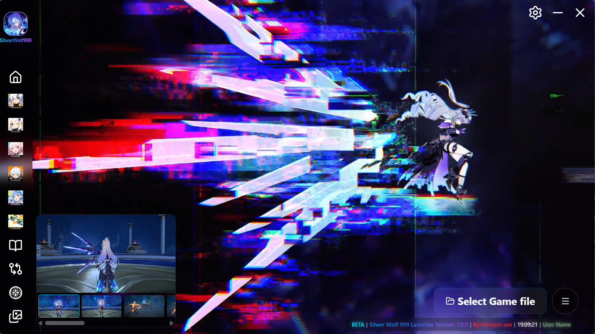

# 🚀 SilwerWolf999 Launcher





A lightweight and modern launcher for Anime game — designed to make launching, updating, and customizing your game easy and efficient.


---

## 🧑‍💻 About the Developer

Hi! I'm **Horoyoi-san**, a developer passionate about building simple and powerful tools.  
SilwerWolf999 Launcher is built with:

- ⚙️ **Go + Wails** for backend/frontend integration  
- 🎨 **Tailwind CSS** + **DaisyUI** for a clean, responsive UI

My goal is to create tools that are fast, efficient, and enjoyable to use.

---

## 📦 Installation

You can choose between:

- ✅ **Portable** version (no install needed)
- 🛠️ **MSI Installer** (for full integration)
1. [go 1.24.0](https://go.dev/dl/go1.24.0.windows-amd64.msi)
2. wails3
```
go install github.com/wailsapp/wails/v3/cmd/wails3@v3.0.0-alpha.34
```
3. [Node.js](https://nodejs.org/en/download/current)
    - เปิด Command Prompt / PowerShell ใหม่ แล้วพิมพ์:
```
node -v
npm -v
```
---

## 🛠️ Common Development Commands (Wails v3)

```bash
# Start the app in development mode (hot reload frontend)
wails3 dev

# Build the application (production binary)
wails3 build

# Package the app (NSIS)
wails3 package
```
---

## 📄 License

MIT License — feel free to use and contribute.

---

